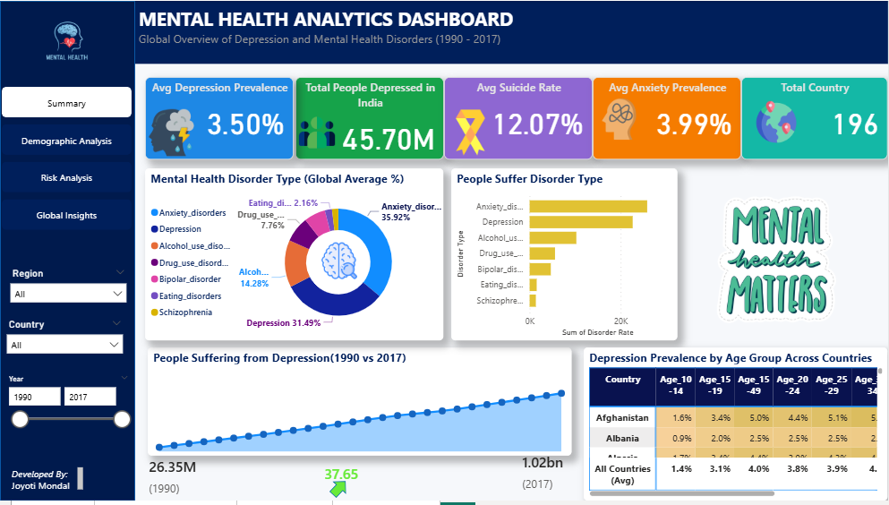

# Mental Health Analytics Dashboard | Power BI
## Project Overview
This project is an interactive **Power BI Mental Health Analytics Dashboard** designed to analyze global mental health trends across countries. The dashboard focuses on depression prevalence, demographic patterns, suicide risk, substance-use disorders, education impact, and country-level insights.

The report is divided into four dashboard pages:

1. **Summary**
2. **Demographic Analysis**
3. **Risk Analysis**
4. **Global Insights**

The goal of this project is to convert raw mental health data into meaningful insights using data cleaning, data modeling, DAX measures, and interactive Power BI visuals.

---

## Dashboard Pages

### 1. Summary

The Summary page gives a high-level overview of mental health indicators.

Key visuals include:

- KPI cards for depression prevalence
- Number of people suffering from depression
- Mental disorder type analysis
- Overall mental health trend summary

This page is useful for quickly understanding the overall mental health situation.

---

### 2. Demographic Analysis

The Demographic Analysis page focuses on how depression differs across population groups.

Key areas covered:

- Depression prevalence by age group
- Depression prevalence by gender
- Depression rates by education level
- Active vs employed population comparison

This page helps identify which demographic groups are more affected by depression.

---

### 3. Risk Analysis

The Risk Analysis page explores factors associated with higher depression prevalence and suicide rates.

Key areas covered:

- Relationship between depression prevalence and suicide rates
- Drug-use disorders vs depression prevalence
- Alcohol-use disorders vs depression prevalence
- Key factor summary matrix

Important note: The analysis shows association and relationship, not causation.

---

### 4. Global Insights

The Global Insights page focuses on country-wise comparison and global trends.

Key areas covered:

- Countries with highest depression prevalence
- Countries with fastest growth in depression prevalence
- Country-wise mental disorder comparison
- Depression burden relative to population size

This page helps compare mental health patterns across different countries.

---

## Dataset Used

The project uses a mental health dataset containing multiple sheets related to depression, mental disorders, suicide rates, gender, age, education, and population.

Main sheets used:

| Sheet Name | Purpose |
|---|---|
| `prevalence-by-mental-and-substa` | Mental disorder prevalence by country and year |
| `prevalence-of-depression-by-age` | Depression prevalence by age group |
| `prevalence-of-depression-males-` | Depression prevalence by gender and population |
| `suicide-rates-vs-prevalence-of-` | Suicide rates and depression prevalence |
| `number-with-depression-by-count` | Number of people suffering from depression |
| `depression-by-level-of-educatio` | Depression by education level and employment status |

---

## Key Business Questions Answered

This dashboard answers the following analytical questions:

- What are the major mental health disorder types?
- How many people suffer from depression?
- Is depression higher in males or females?
- Which age group is most affected by depression?
- What is the relationship between depression prevalence and suicide rates?
- Which countries have the highest depression prevalence?
- Which countries experienced the fastest growth in depression prevalence?
- Which mental disorder is most prevalent in each country?
- How does education level impact depression rates?
- Are countries with higher drug-use or alcohol-use disorders more likely to have higher depression prevalence?
- What are the key factors associated with higher depression prevalence and suicide rates?

---

## Tools and Technologies Used

- **Power BI Desktop**
- **Power Query**
- **DAX**
- **Data Modeling**
- **Excel Dataset**
- **Data Cleaning**
- **Interactive Visualizations**

---

## Data Cleaning and Transformation

Key transformation steps performed in Power Query:

- Removed unnecessary columns
- Renamed long column names for readability
- Changed data types
- Removed null values where required
- Unpivoted age group columns
- Unpivoted gender columns
- Unpivoted mental disorder columns
- Created clean category fields such as:
  - Age Group
  - Gender
  - Disorder Type
  - Education Level
  - Population Status

These transformations helped convert wide-format data into analysis-ready long-format tables.

---

## Important DAX Measures

Some of the key DAX measures used in the dashboard include:

```DAX
Avg Depression % =
AVERAGE('Table'[Depression %])
```

```DAX
People with Depression =
SUM('number-with-depression-by-count'[People Suffering Depression])
```

```DAX
Suicide as % of Depression Rate =
DIVIDE([Avg Suicide Rate], [Avg Depression Rate]) * 100
```

```DAX
Depression Growth =
[Depression 2017] - [Depression 1990]
```

```DAX
Female Male Gap % =
[Female Depression %] - [Male Depression %]
```

---

## Key Insights

Some major insights from the dashboard:

- Depression prevalence differs across age groups, gender, education levels, and countries.
- Older age groups show higher depression prevalence globally.
- Female depression prevalence is higher than male depression prevalence in the dataset.
- Lower educational attainment is associated with higher depression rates.
- Drug-use disorders show a positive relationship with depression prevalence.
- Suicide rates show a moderate positive relationship with depression prevalence.
- Country-wise analysis shows differences in depression burden and growth over time.

---

## Recommended Visuals Used

| Analysis Question | Visual Used |
|---|---|
| Disorder type distribution | Donut Chart |
| People suffering by disorder type | Clustered Bar Chart |
| Depression by gender | Clustered Column / Bar Chart |
| Depression by age group | Clustered Bar Chart |
| Depression vs suicide rate | Scatter Chart |
| Drug/alcohol use vs depression | Scatter Chart |
| Country-wise prevalence | Bar Chart |
| Trend over time | Line Chart |
| Key factor summary | Table / Summary Matrix |
| Country and age comparison | Matrix / Heatmap |

---

## Dashboard Preview

Add your dashboard screenshots here:

```markdown



```

---

## How to Use This Dashboard

1. Open the Power BI file.
2. Use slicers to filter by country, year, disorder type, gender, and age group.
3. Navigate through the four dashboard pages.
4. Compare trends, demographic patterns, and risk relationships.
5. Use tooltips and filters to explore deeper insights.

---

## Disclaimer

This dashboard is created for analytical and educational purposes. The findings show trends, comparisons, and associations based on the dataset. They should not be interpreted as medical conclusions or proof of causation.

---

## Project Outcome

This project demonstrates the ability to:

- Clean and transform complex healthcare data
- Build a structured Power BI data model
- Create meaningful DAX measures
- Design interactive dashboards
- Analyze demographic and global mental health trends
- Present insights clearly using visual storytelling

---

## Author

**Joyoti Mondal**

Power BI Dashboard Project  
Mental Health Analytics
